<div align="center">

# 💼 PayrollPro

**A modern HR, attendance & payroll management system for Indonesian companies**

Built with Laravel, Vue 3 and Inertia.js — covering employee management, attendance (QR & mobile), BPJS, PPh 21, payslips, reports, and a self-service employee portal.

[](https://laravel.com)
[](https://php.net)
[](https://vuejs.org)
[](https://inertiajs.com)
[](https://tailwindcss.com)

[](https://github.com/qoidrifat/payrollpro/actions)
[](https://github.com/qoidrifat/payrollpro/actions)
[](https://github.com/qoidrifat/payrollpro/actions)
[](https://opensource.org/licenses/MIT)

**Production-grade architecture · Clean code · Tested · CI-ready**

</div>

---

## ✨ Overview

Managing HR and payroll for an Indonesian company means dealing with a lot of local complexity — **BPJS Kesehatan**, **BPJS Ketenagakerjaan**, **PPh 21**, **PTKP**, attendance policies, and monthly payroll runs. Most small teams still do this in spreadsheets.

**PayrollPro** is an open-source answer to that problem. It combines a complete HR back office with a **self-service employee portal** and a **public status page**, wrapped in a modern, responsive UI with light & dark mode.

Whether you're an HR admin processing payroll or an employee checking your payslip from a phone, everything lives in one clean, fast application.

---

## 🚀 Features

| Module | Highlights |
| --- | --- |
| **Dashboard** | Payroll, attendance, employee & operational status overview with charts |
| **Employees** | CRUD, Excel import/export, soft deletes, tax/BPJS/bank identity, encrypted PII |
| **Attendance** | Manual entry, **QR clock-in/out**, mobile API with GPS/geofence & offline sync |
| **Payroll** | Payroll runs, salary components, BPJS, PPh 21, PTKP, proration, payslip PDF |
| **Reports** | Payroll, tax & attendance reports with Excel export |
| **Employee Portal** | Self-service attendance history, payslips, tax info & leave requests |
| **Leave & Overtime** | Request → approval workflow with notifications |
| **Status Page** | Public service status, health API, incidents & maintenance windows |
| **Administration** | Settings, activity log, role & permission management, API docs |
| **Security** | RBAC, encrypted sensitive fields, CSP headers, rate limiting, audit trails |
| **Monitoring** | Laravel Pulse dashboards + scheduled maintenance commands |

---

## 🏗️ Technology Stack

| Layer | Technologies |
| --- | --- |
| **Backend** | Laravel 12, PHP 8.2+, Breeze, Sanctum, Pulse, Sentry, Spatie Permission |
| **Frontend** | Vue 3, Inertia.js 2, Tailwind CSS 3, Vite 7, ApexCharts, Heroicons |
| **Database** | MySQL 8 · PostgreSQL / Supabase · SQLite |
| **Export** | DomPDF (payslips), Laravel Excel, PHPWord |
| **Runtime** | Queue workers, scheduler, Redis-ready configuration |
| **CI/CD** | GitHub Actions (lint, tests, build, security audit, deploy) |
| **Testing** | PHPUnit 11 — 229 tests, 436 assertions |

---

## 🏛️ System Architecture

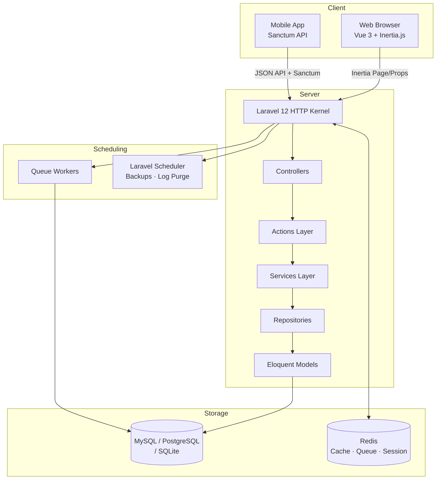

**Layering rules** — controllers stay as thin HTTP adapters; business rules live in `Services`; multi-step workflows are orchestrated in `Actions`; data access goes through `Repositories`; domain constants are type-safe `Enums`.

---

## 📸 Screenshots

<div align="center">

### Admin Dashboard

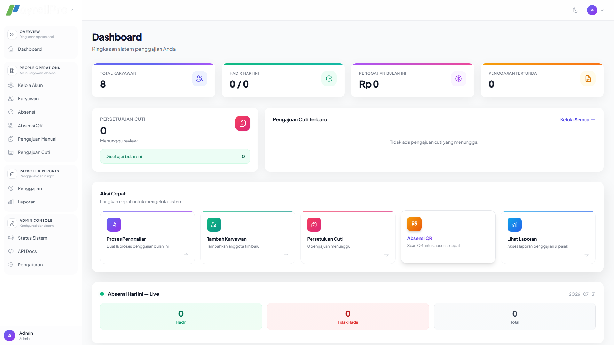

### Payroll Processing

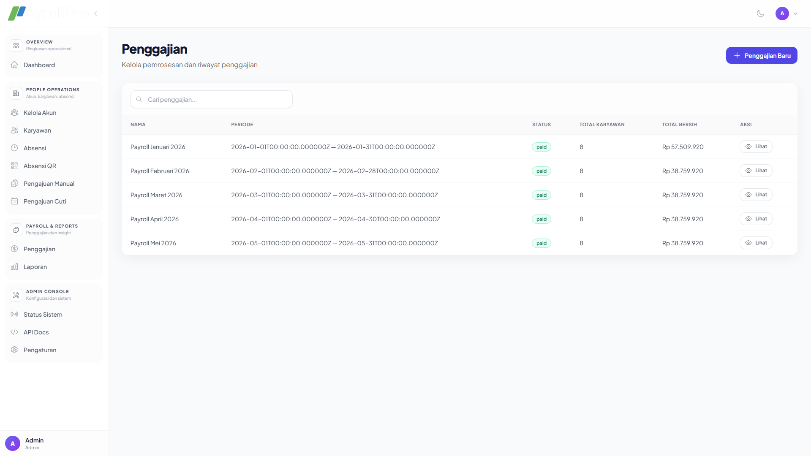 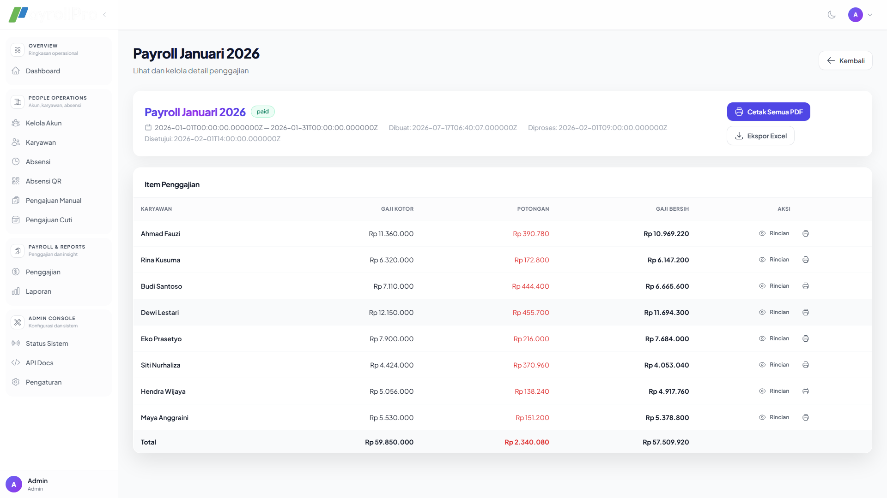

### Attendance & My QR

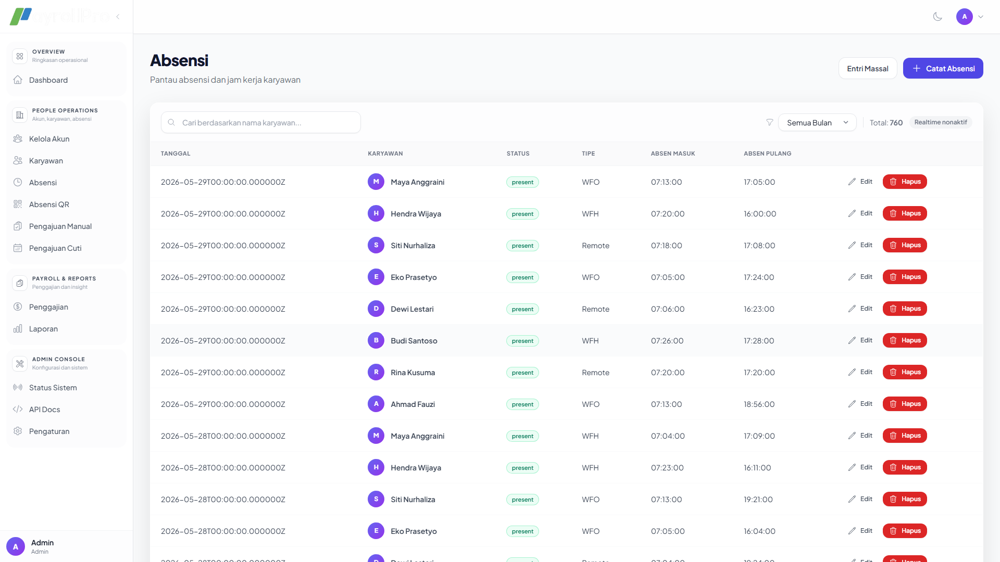 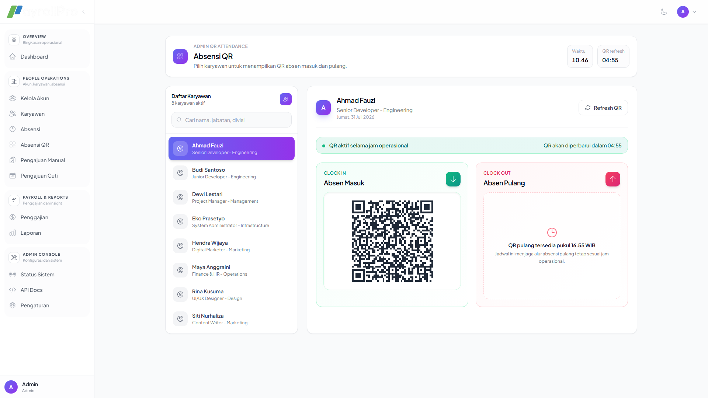

### Employees & Reports

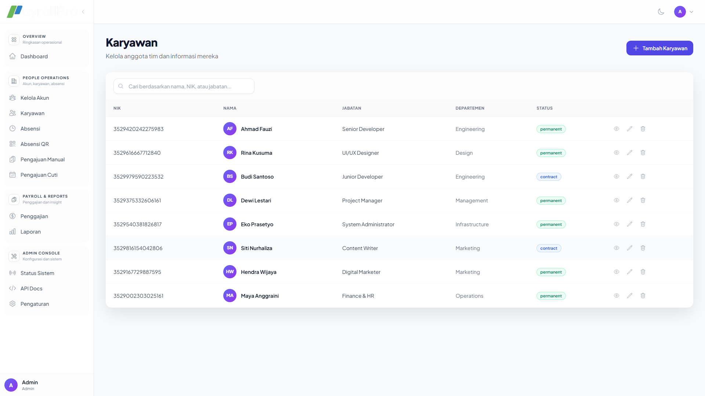 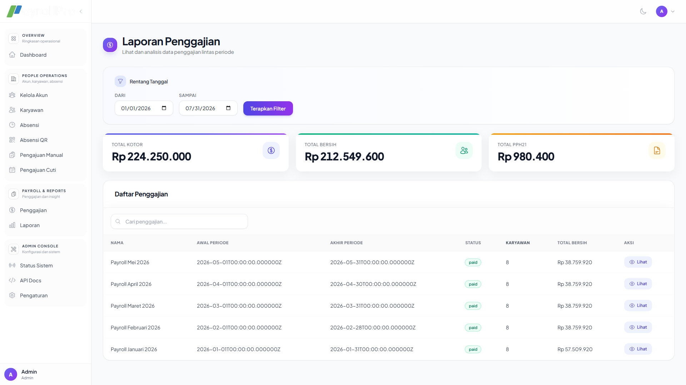

### Employee Portal (Self-Service)

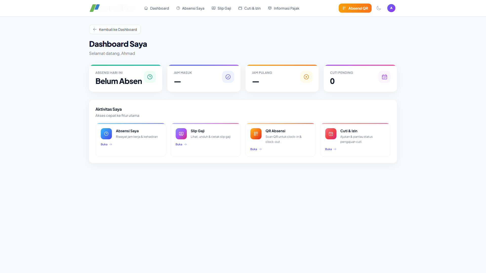 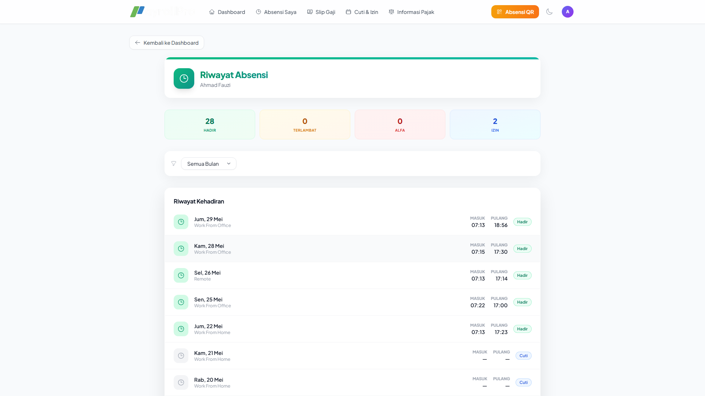

### Dark Mode

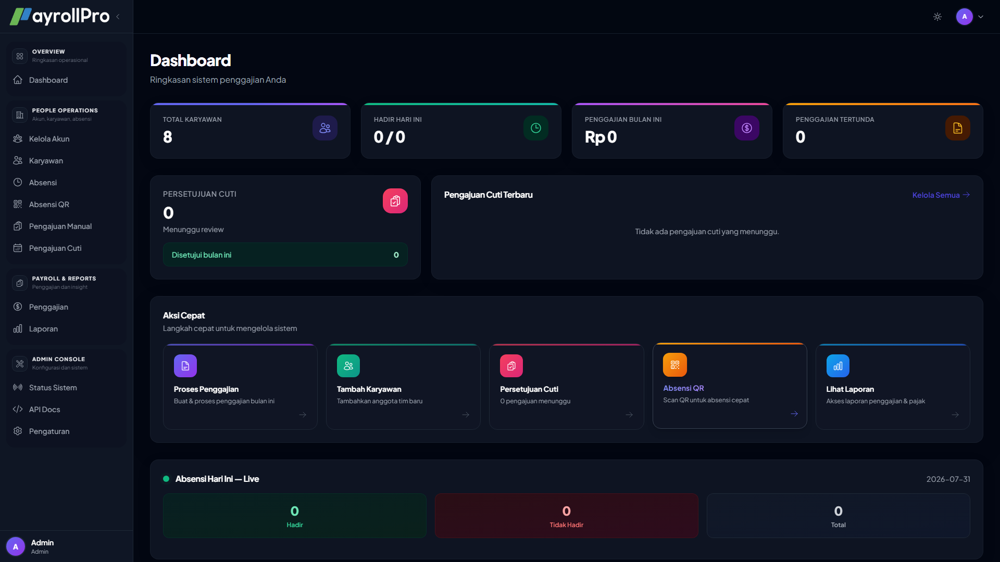

### Responsive / Mobile

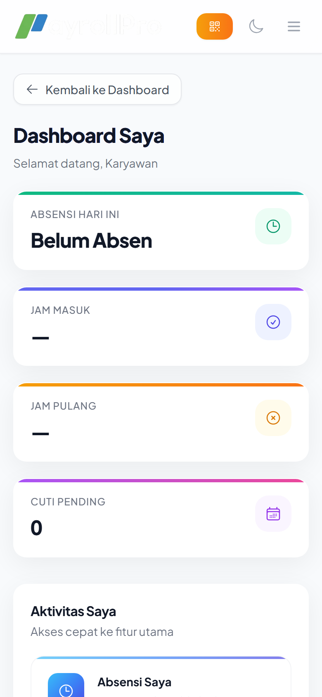

</div>

> Screenshots are captured with a realistic seeded dataset (8 employees, 5 payroll runs, 760 attendance records). The capture tooling lives in [`scripts/capture-screenshots.mjs`](scripts/capture-screenshots.mjs) and [`scripts/capture-mobile.mjs`](scripts/capture-mobile.mjs).

---

## 📦 Installation

### Requirements

- **PHP 8.2+** with `bcmath`, `ctype`, `dom`, `fileinfo`, `gd`, `json`, `mbstring`, `openssl`, `pdo`, `pdo_mysql`/`pdo_pgsql`/`pdo_sqlite`, `tokenizer`, `xml`, `zip`
- **Composer 2**
- **Node.js 20+** & npm
- **MySQL 8**, **PostgreSQL/Supabase**, or **SQLite**

### Quick Start

```bash
# 1. Clone & install dependencies
git clone https://github.com/qoidrifat/payrollpro.git
cd payrollpro
composer install
npm install

# 2. Configure environment
cp .env.example .env
php artisan key:generate

# 3. Choose a database — SQLite (simplest):
touch database/database.sqlite
#    then set DB_CONNECTION=sqlite in .env
#    — or use MySQL / PostgreSQL (see .env.example)

# 4. Migrate, seed & link storage
php artisan migrate --seed
php artisan storage:link

# 5. Build assets & run
npm run build
php artisan serve        # → http://127.0.0.1:8000
```

### Demo Accounts

The seeder creates these accounts:

| Role | Email | Password |
| --- | --- | --- |
| Admin | `admin@project-kp.test` | `password` |
| HR | `hr@project-kp.test` | `password` |
| Employee | `ahmad.fauzi.1@project-kp.test` | `password` |

> ⚠️ Change these credentials before any public deployment.

---

## 🧑‍💻 Development

```bash
# Start everything (server + queue + Vite + logs)
composer run dev

# Or individually
php artisan serve
php artisan queue:listen --tries=1 --timeout=0
npm run dev
```

### Key URLs (local)

| URL | Purpose |
| --- | --- |
| `/` | Landing page |
| `/login` | Authentication |
| `/demo` | One-click demo login (local only) |
| `/dashboard` | Authenticated dashboard |
| `/status` | Public status page |
| `/api/health` | Health check |
| `/developer/api-docs` | Mobile API documentation (admin) |
| `/pulse` | Laravel Pulse (admin) |

---

## 📂 Project Structure

```text
payrollpro/
├── app/
│   ├── Actions/          # Workflow orchestration (payroll, attendance, approvals)
│   ├── DTOs/             # Data transfer objects
│   ├── Enums/            # Type-safe domain constants
│   ├── Exports/          # Excel export classes
│   ├── Http/             # Controllers, requests, middleware, resources
│   ├── Jobs/             # Queue jobs
│   ├── Listeners/        # Event listeners
│   ├── Models/           # Eloquent models
│   ├── Notifications/    # Notification classes
│   ├── Policies/         # Authorization policies
│   ├── Repositories/     # Repository interfaces & implementations
│   ├── Scopes/           # Global scopes
│   ├── Services/         # Business logic (payroll, tax, BPJS, geofence)
│   └── Traits/           # Shared model behaviour
├── bin/                  # Utility scripts (schema export, PDF patch)
├── config/               # Laravel configuration
├── database/
│   ├── factories/
│   ├── migrations/
│   └── seeders/
├── demo/                 # Automated demo-video recording system
├── docker/               # Docker/nginx configuration
├── docs/                 # Documentation & API spec
│   ├── images/           # Screenshots used in this README
│   ├── reports/          # Engineering audit & feature reports
│   └── mobile-api.yaml   # OpenAPI spec for the mobile attendance API
├── lang/                 # Localization files
├── public/               # Web root (built assets)
├── resources/
│   ├── css/
│   ├── js/               # Vue 3 + Inertia components & pages
│   └── views/
├── routes/
├── supabase/             # Supabase RLS migrations & rollbacks
├── tests/                # PHPUnit feature & unit tests
└── .github/workflows/    # CI, tests, security audit
```

---

## 📡 API

PayrollPro exposes a **mobile attendance API** (Sanctum-protected) documented in [`docs/mobile-api.yaml`](docs/mobile-api.yaml) and browsable at `/developer/api-docs`.

| Method | Endpoint | Auth |
| --- | --- | --- |
| `GET` | `/api/mobile/status` | Sanctum |
| `POST` | `/api/mobile/clock-in` | Sanctum |
| `POST` | `/api/mobile/clock-out` | Sanctum |
| `POST` | `/api/mobile/sync-offline` | Sanctum |

### QR Attendance (signed URLs)

| Method | Endpoint | Notes |
| --- | --- | --- |
| `GET` | `/scan/in/{employee}` | Signed URL |
| `GET` | `/scan/out/{employee}` | Signed URL |
| `POST` | `/scan/clock-in/{employee}` | Authenticated |
| `POST` | `/scan/clock-out/{employee}` | Authenticated |

---

## 🧪 Testing

```bash
composer run test     # or: php artisan test
```

The suite covers services, policies, auth, attendance, employee management, payroll, the employee portal, reports, settings and payslips — **262 tests / 568 assertions**.

---

## 🚀 Deployment

### Docker (recommended)

```bash
docker compose up -d
```

A `render.yaml` blueprint is also included for [Render](https://render.com) one-click deployment (Docker provider + health check).

### Manual (VPS / shared hosting)

```bash
composer install --no-dev --optimize-autoloader
npm ci && npm run build
php artisan migrate --force
php artisan storage:link
php artisan config:cache && php artisan route:cache && php artisan view:cache
```

Queue worker (Supervisor/systemd):

```bash
php artisan queue:work --tries=3 --timeout=60
```

Scheduler (cron):

```cron
* * * * * cd /path/to/project && php artisan schedule:run >> /dev/null 2>&1
```

Scheduled commands include `DatabaseBackup` (daily 02:00, 30-day retention) and `PurgeActivityLogs` (daily 00:00, 90-day retention).

---

## 🗺️ Roadmap

- [ ] Email notifications for approval requests & payslips
- [ ] Scheduled payroll runs
- [ ] Multi-company / multi-branch support (schema-ready)
- [ ] Payslip email delivery
- [ ] PWA offline attendance capture
- [ ] i18n (Indonesian / English UI switching)
- [ ] Dark-mode QR scan experience

---

## 🤝 Contributing

Contributions are what make the open-source community amazing. Please read the [Contributing Guidelines](CONTRIBUTING.md) and our [Code of Conduct](CODE_OF_CONDUCT.md).

1. 🍴 Fork the repository
2. 🌿 Create a feature branch (`git checkout -b feature/amazing`)
3. 💾 Commit your changes (`git commit -m 'Add some amazing feature'`)
4. 📤 Push to the branch (`git push origin feature/amazing`)
5. 🔀 Open a pull request

Found a security issue? See [SECURITY.md](SECURITY.md) for our disclosure policy.

---

## 📄 License

Distributed under the **MIT License**. See [LICENSE](LICENSE) for more information.

---

## 👤 Author

**Qoid Rifat** — Full-stack developer building for the Indonesian SaaS ecosystem.

[](https://github.com/qoidrifat)
[](https://github.com/qoidrifat)

<div align="center">
  <sub>Built with ❤️ and ☕ — Laravel, Vue & Inertia.</sub>
</div>
